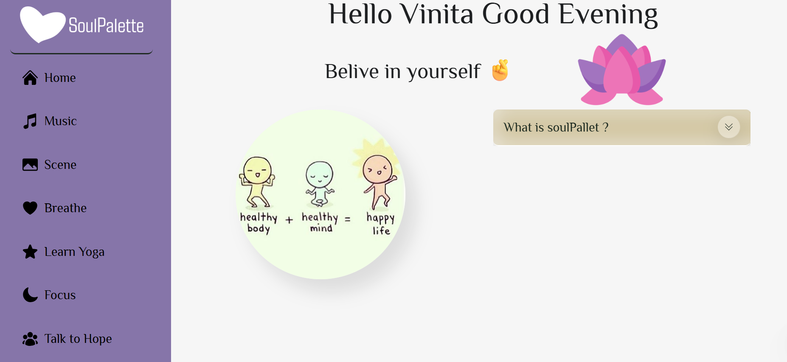
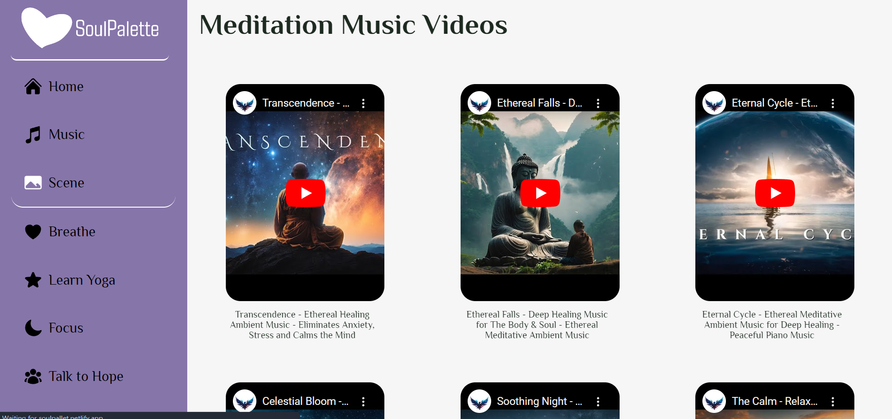
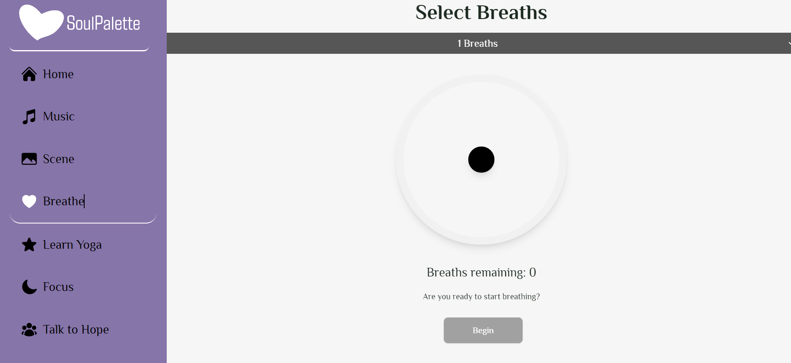
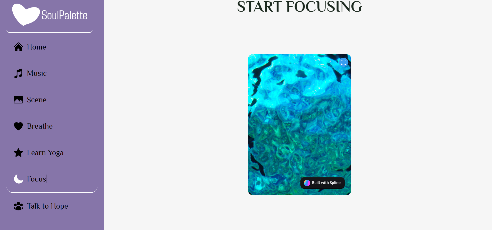
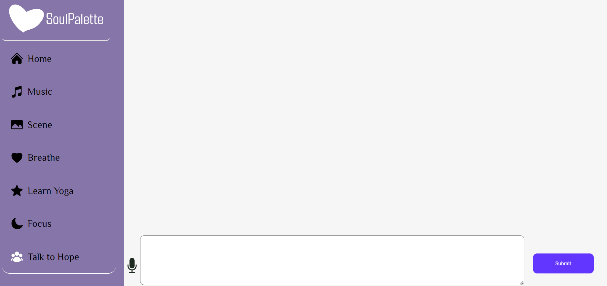

# ✨Soul Pallet

Hyy my name is Vinita Prakash Singh, 👋 Welcome to our Soul Pallet! This project aims to provide users with a serene online environment for practicing yoga, meditation, and promoting mental well-being. and have some playing exercises for breathing and have a talk to hope Ai that works for you all day and night.

The page is live there -> [Hosted link](https://soulpallet.netlify.app/) 
    

## Features:

1. **Yoga Videos:** Access a collection of yoga instructional videos covering various poses and routines.
2. **Peaceful Sounds:** Immerse yourself in a tranquil atmosphere with a selection of soothing sounds.
3. **Yoga Panel:** Detailed information about different yoga practices, including benefits and step-by-step instructions.
4. **Talk to Hope:** An interactive feature integrated with Gemini AI, allowing users to engage in conversations related to mental health and well-being.
5. **Focus Mode:** An interactive feature integrated with spline that help users to watch and focus on the water ball.

## Technologies Used:

- **Frontend:** HTML, CSS, JavaScript
- **Integration:** Gemini AI API

## Getting Started:

To run the project locally, follow these steps:

1.Clone this repository to your local machine:
   ```bash

   ```
2. Navigate to the project directory.
3. Open the `index.html` file in your web browser.

## Usage:

- Explore different yoga videos and practices.
- Listen to peaceful sounds to enhance your meditation experience.
- Learn about the benefits and techniques of various yoga poses in the Yoga Panel.
- Engage in conversations related to mental health and well-being using the Talk to Hope feature.

## Screenshots










## Contributing:

We welcome contributions from the community to enhance this project further. If you'd like to contribute, please follow these steps:

1. Fork the repository.
2. Create your feature branch (`git checkout -b feature/YourFeature`).
3. Commit your changes (`git commit -am 'Add some feature'`).
4. Push to the branch (`git push origin feature/YourFeature`).
5. Create a new Pull Request.

## Acknowledgements:

- Special thanks to Gemini AI for providing the conversational AI integration.
- Credits to the creators of the yoga videos and peaceful sounds used in the project.
- Thanks to the open-source community for their valuable contributions.

